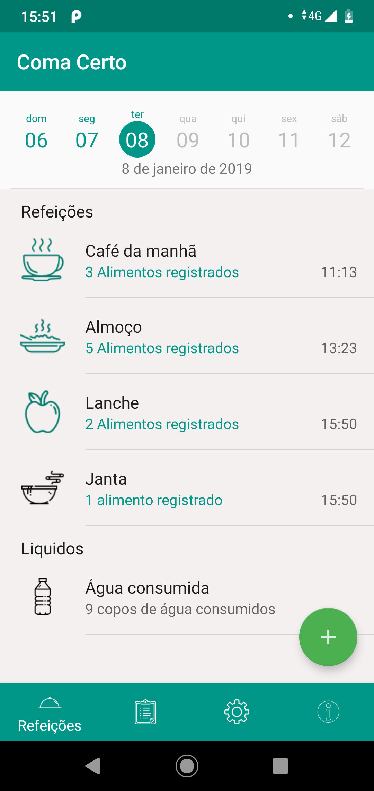
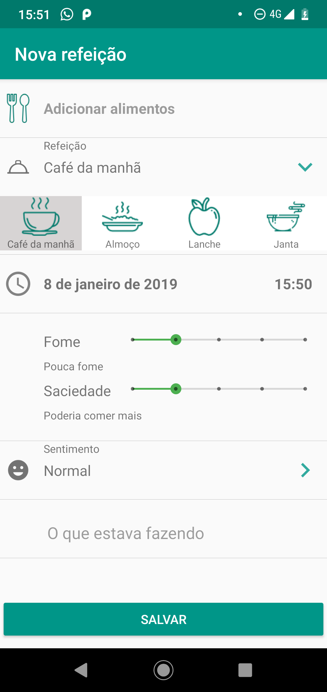
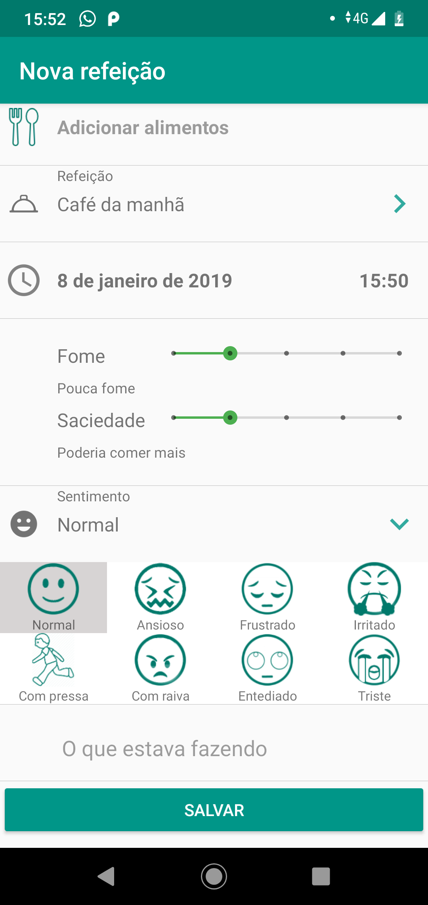
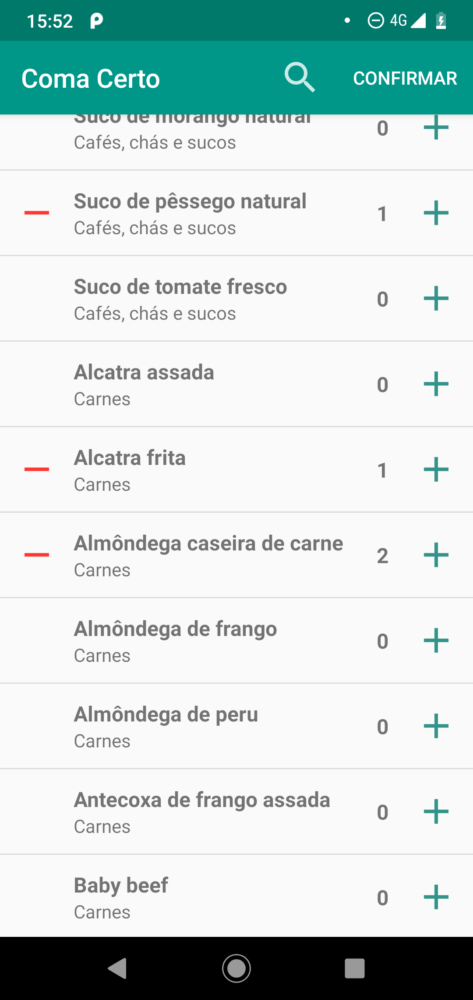
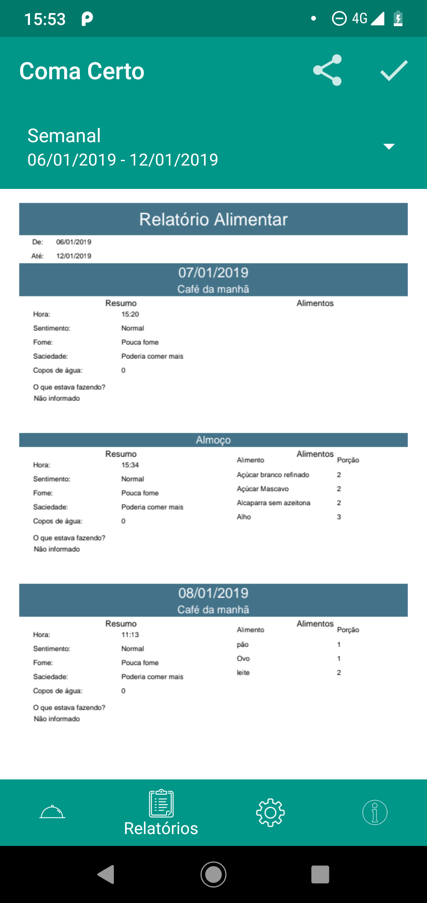
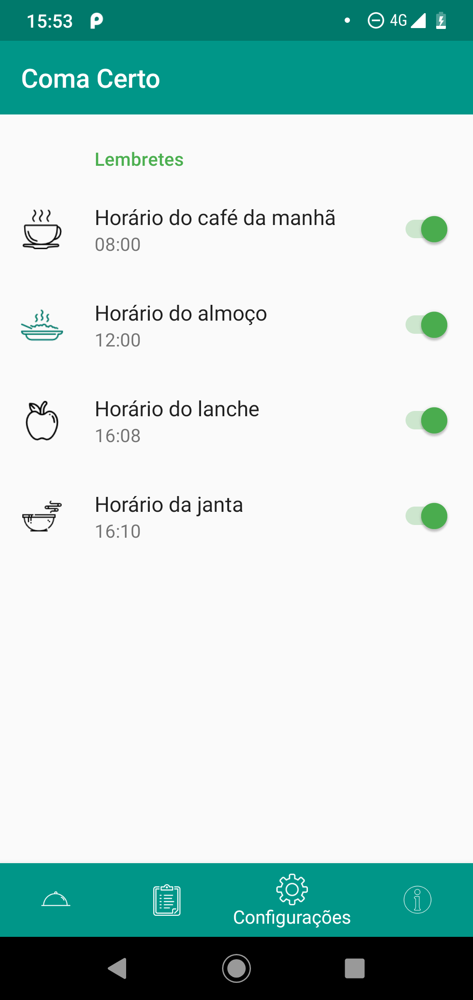

# Coma Certo

## Introdução

No tratamento dos transtornos alimentares, os sujeitos precisam aumentar ao máximo o nível de consciência do próprio comportamento alimentar para aumentar o autocontrole. O diário alimentar é uma ferramenta essencial para que o paciente, durante o registro, esteja atento aos mecanismos que o leva a comer de forma compulsiva. Além disso, o relatório do registro pode ser utilizado em parceria com o profissional da saúde que o acompanha, analisando os erros que o paciente tem cometido e corrigi-los.

## O aplicativo

Ter um registro de sua alimentação é o primeiro passo para uma reeducação alimentar, e o profissional da saúde que te acompanha necessitará destas informações. Entretanto carregar papel e caneta para todo lugar é pouco prático, e poucas pessoas terão disciplina para registrar corretamente todas as refeições desta maneira. 
O Objetivo deste aplicativo é facilitar o registro e o compartilhamento das informações do consumo alimentar do usuário com o profissional de saúde responsável.

### Funcionalidades
- Registre suas refeições
- Acompanhe suas refeições diárias
- Gere e compartilhe o seu relatório alimentar

### Acompanhe suas refeições diárias

O usuário pode acompanhar todas as suas refeições, agrupadas por dia e ordenadas pelo horário. A partir desta tela é possível editar e excluir 
as refeições cadastradas anteriormente

 

### Registre suas refeições

O usuário pode fazer o registro de sua alimentação, registrando as informações de:
- Qual refeição está fazendo (Café da Manhã, Almoço, Lanche e Janta )
- Data e hora da refeição
- Os alimentos consumidos
- Seu nível de fome e saciedade
- Como a pessoa estava se sentindo no momento da refeição

  


### Relatório alimentar

Aqui o usuário pode acompanhar seu diário alimentar de um determinado período, e visualizar as informações agrupadas em um arquivo PDF, pronto para ser compartilhado com seu profissional de saúde.



### Não se esqueça das suas Refeições

Adicione lembretes para suas principais refeições, para que você nunca se esqueça de comer na hora certa



## Instalação

### Pré requisitos

- Android Studio versão 3.0 ou superior
- Gradle versão 4.6 ou superior
- Java versão 7 ou superior
- Kotlin versão 1.2.51 ou superior


### Procedimento

Para realizar a instalação do projeto localmente, siga os seguintes passos: 

1. Abra o terminal e navegue até um diretório de sua preferência
2. Realize o clone do projeto
```
git clone https://github.com/eduardossampaio/ComaCerto-Android.git
```

1. Abra o <b>Android Studio</b> e carregue o projeto 
2. execute a sincronização do gradle para importar as bibliotecas
3. Compile o projeto em um aparelho ou emulador Android 5.0 ou superior
   
